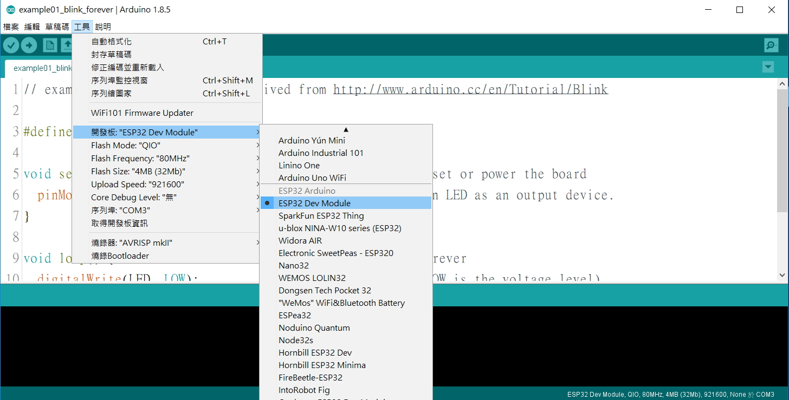
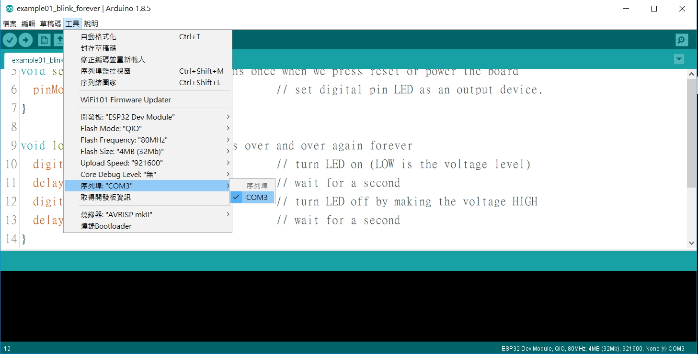

# YAFVM -- Yet Another Forth Virtual Machine on Arduino
### samsuanchen@gmail.com & derek@wifiboy.org

## Abstract

	Having seen https://github.com/mikaelpatel/Arduino-FVM/, we provide
	yet another Arduino FVM, an alternative Forth Virtual Machine on Arduino.
	Extending a little bit to an arduino code, for example the led blinking, 
	a useful virtural machine will be activated in the same time.
	So that, via arduino IDE console, we could enter simple commands to check, test, 
	even change the features of the arduino code. This article is trying to
	describe, by examples, how simple we could use this virtural machine.

## 摘要

	雖然有人在 arduino 上已提供了 https://github.com/mikaelpatel/Arduino-FVM/,
	我們嘗試, 另外提供較方便使用的的 FVM 虛擬機 版本。
	在 arduino IDE 開啟一個正常運行的 範例程式, 例如 blink,
	只要稍改程式, 加幾行指令, 打開 Serial Port Console,
	程式載入同時, 一個方便的 FVM 虛擬機 就被啟動了, 
	這 虛擬機 與原來的 範例程式 同步執行。
	我們可隨時輸入 虛擬機 指令, 以檢視、測試、甚至改變 原來程式的功能。
	本文將逐步說明, 以範例解說如何運用這 FVM 虛擬機。

## 範例01 【led 閃不停】 example01_blink_forever.ino

此程式實際上就是 arduino 所提供 led 閃不停 的範例 blink.ino。

```
// example01_blink_forever.ino derived from http://www.arduino.cc/en/Tutorial/Blink

#define LED 16                           // LED pin gpio #

void setup() { // this function runs once when we press reset or power the board
  pinMode(LED, OUTPUT);                  // set digital pin LED as an output device.
}

void loop() { // this function runs over and over again forever
  digitalWrite(LED, LOW);                // turn LED on (LOW is the voltage level)
  delay(1000);                           // wait for a second
  digitalWrite(LED, HIGH);               // turn LED off by making the voltage HIGH
  delay(1000);                           // wait for a second
}
```

打開範例, 這是所見到 arduino IDE 可能的畫面。


首次打開範例, 需要選定開發板。


還要選定 com port。


編碼載入, 就會看到 led 開始閃。


## 範例02 【led 閃 10 次】 example02_blink_10_times.ino

為增加一點變化, 我們可宣告一個 預設為 10 的 變數 times。 閃 led 前, 先檢視 times 若為 0 , 就不再閃。
led 每閃 1 次, 變數 times 遞減 1。 閃 10 次之後, times 就會變為 0。因此, 編碼載入這程式 就會準確地
閃 led 10 次。

```
// example02_blink_10_times.ino derived from http://www.arduino.cc/en/Tutorial/Blink

#define LED 16                           // LED pin gpio #

int times = 10;                          // ##### 1. preset to blink led 10 times

void setup() { // this function runs once when we press reset or power the board
  pinMode(LED, OUTPUT);                  // set digital pin LED as an output device.
}

void loop() { // this function runs over and over again forever

  if( ! times ) return;                  // ##### 2. no more blinking if times is 0
  times--;                               // ##### 3. decrease times by 1

  digitalWrite(LED, LOW);                // turn LED on (LOW is the voltage level)
  delay(1000);                           // wait for a second
  digitalWrite(LED, HIGH);               // turn LED off by making the voltage HIGH
  delay(1000);                           // wait for a second
}
```

## 範例03 【隨時叫 led 閃幾次】 example03_blink_given_number_of_times.ino

範例02 叫 led 閃 10 次, 其中變數 times 的數值預設為 10, 是控制 led 閃 10 次的關鍵。若隨時能檢視 times 
的數值, 就知道程式的執行進度, 知道 led 還有幾次要閃。若隨時能更改 times 的數值, 我們就能隨時叫 led 閃
幾次了。當然, 我們可以修改程式, 在讀取 times 數值之後叫 led 閃。在此範例, 我們嘗試另類方案, 增加幾行指令, 
啟動一個同步運行的 FVM 虛擬機 F, 並將變數 times 的儲存位址設為 虛擬機 F 的常數 n。在程式啟動 led 閃 10
次後, 從 arduino IDE console 的輸入格, 我們就可隨時下 虛擬機 F 的指令, 例如: "n ?" 檢視 led 還有幾次要
閃; "5 n !" 設定 led 還要閃 5 次。

```
// example03_blink_given_number_of_times.ino derived from http://www.arduino.cc/en/Tutorial/Blink

#define LED 16                           // LED pin gpio #
int times = 10;                          // blink led 10 times initially

                                         // ##### 0. Crtl+Shift+M open Serial Port Console

# include <fvm01.h>                      // ##### 1. load FVM the Forth virtual machine
FVM F = FVM();                           // ##### 2. define F as an instence of FVM

void setup() { // this function runs once when we press reset or power the board
  pinMode(LED, OUTPUT);                  // initialize digital pin LED as an output device.

  F.init( 115200 );                      // ##### 3. init virtual machine F, baud rate 115200
  F.newConstant( "n", (int)&times );     // ##### 4. set the address of times as the constant n in F
}

void loop() { // this function runs over and over again forever

  F.update();                            // ##### 5. run virtual machine F

  if( ! times ) return;                  // no more blinking if times is 0
  times--;                               // decrease times by 1

  digitalWrite(LED, LOW);                // turn LED on (LOW is the voltage level)
  delay(1000);                           // wait for a second
  digitalWrite(LED, HIGH);               // turn LED off by making the voltage HIGH
  delay(1000);                           // wait for a second
}
```

## 範例04 【另法隨時叫 led 閃幾次】 example04_another_way_to_blink.ino

直接 對外揭露程式內部的變數儲存位址, 有人會覺得很不安全, 因為違反了 Object-oriented 程式設計的原則。
FVM 其實也是可以讓使用者自訂 檢視變數 與 更改變數 子程式作為 虛擬機 F 的指令。此範例中, 就分別定義了
showTimes() 與 setTimes() 作為 虛擬機 F 之指令 n? 與 n! 所要執行的子程式。這樣, 我們就可隨時從 arduino
IDE console 檢視/更改 times。例如: 從輸入格 下指令 "n?" 以檢視 led 還有幾次要閃; 下指令 "3 n!" 以設定
led 還要閃 3 次。更有趣的是, 我們還可下一連串的指令, 例如 "n? 5 n! n? n? n? n? n?", 看到 led 閃 並且
console 同時顯示還有幾次要閃的倒數。

```
// example04_another_way_to_blink.ino derived from http://www.arduino.cc/en/Tutorial/Blink

#define LED 16                           // LED pin gpio #
int times = 10;                          // blink led 10 times initially

                                         // ##### 0. Crtl+Shift+M open Serial Port Console

# include <fvm01.h>                      // ##### 1. load FVM the Forth virtual machine
FVM F = FVM();                           // ##### 2. define F as an instence of FVM
void setTimes(){ times = F.dPop(); }     // ##### 3. define  setTimes() to  set times
void showTimes(){ Serial.print(times); } // #####    define showTimes() to show times

void setup() { // this function runs once when we press reset or power the board
  pinMode(LED, OUTPUT);                  // initialize digital pin LED as an output device.

  F.init( 115200 );                      // ##### 4. init virtual machine F, baud rate 115200
  F.newPrimitive( "n!", setTimes );      // ##### 5. let  setTimes as the new command n! in F
  F.newPrimitive( "n?", showTimes);      // #####    let showTimes as the new command n? in F
}

void loop() { // this function runs over and over again forever

  F.update();                            // ##### 6. run virtual machine F

  if( ! times ) return;                  // no more blinking if times is 0
  times--;                               // decrease times by 1

  digitalWrite(LED, LOW);                // turn LED on (LOW is the voltage level)
  delay(1000);                           // wait for a second
  digitalWrite(LED, HIGH);               // turn LED off by making the voltage HIGH
  delay(1000);                           // wait for a second
}
```

任何程式要讓他產生較多的變化, 直接的方法就是增加較多的變數, 用以 檢視狀態/控制效果。當這些變數
大量增加時, 要想隨時 檢視/控制 這些變數, 自然會大大增加傳統方式 撰寫/修改 程式的 複雜度 與 困難度。
照所提供範例, 啟動 同步運行的 虛擬機 F, 將 變數儲存位址 設為 F 的常數 或 自訂 檢視變數 與 更改變數
子程式作為 虛擬機 F 的指令, 即可大大簡化 撰寫/修改 程式的 複雜度 與 困難度。對入門的初學者而言尤其是這樣。
